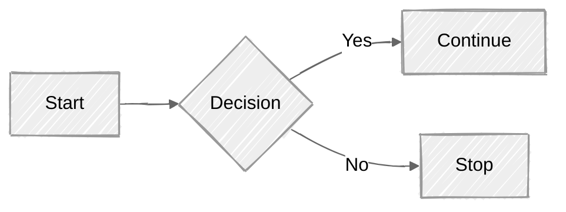

https://mermaid.js.org/intro/syntax-reference.html#configuration

----

配置是 Mermaid 的第三个组成部分，前两个是部署和语法。它主要介绍如何在不同的部署环境中对 Mermaid 进行自定义。

## Frontmatter

Frontmatter 是指在代码开头添加 YAML 元数据。这允许在图表渲染之前对其进行重新配置。您可以通过在定义前后各添加 `---` 来传递元数据 Frontmatter。

**这三个破折号必须是第一行中唯一的字符**。

Frontmatter 使用 YAML 语法。它要求缩进必须保持一致，并且设置区分大小写。Mermaid 会忽略拼写错误，但格式错误的参数会导致图表出错。

```yaml
---
title: Frontmatter Example
displayMode: compact
config:
  theme: forest
gantt:
    useWidth: 400
    compact: true
---
......
```


## 配置

详细的配置项在这里：

https://mermaid.js.org/config/setup/mermaid/interfaces/MermaidConfig.html

### 标题 title

设置方式：

```yaml
---
title: Title Example
---
```

### 主题 theme

设置方式：

```yaml
---
config:
  theme: forest
---
```

可选值： "default" | "base" | "dark" | "forest" | "neutral" | "null"，默认 "default"

定义： packages/mermaid/src/config.type.ts:64


### look

```yaml
config:
  look: classic
```

可选值： "classic" | "handDrawn" 

示例：



> 备注： hugo 的 mermaid 渲染不出来，用 mermaid 的在线编辑器就能看到手绘效果。

### 手绘风格

```yaml
handDrawnSeed
config:
  theme: forest
```