https://mermaid.js.org/syntax/sequenceDiagram.html

---

序列图是一种交互图，它显示了各个过程如何相互协作以及协作的顺序。

最简单的例子：

```yaml
sequenceDiagram
    Alice->>John: Hello John, how are you?
    John-->>Alice: Great!
    Alice-)John: See you later!
```

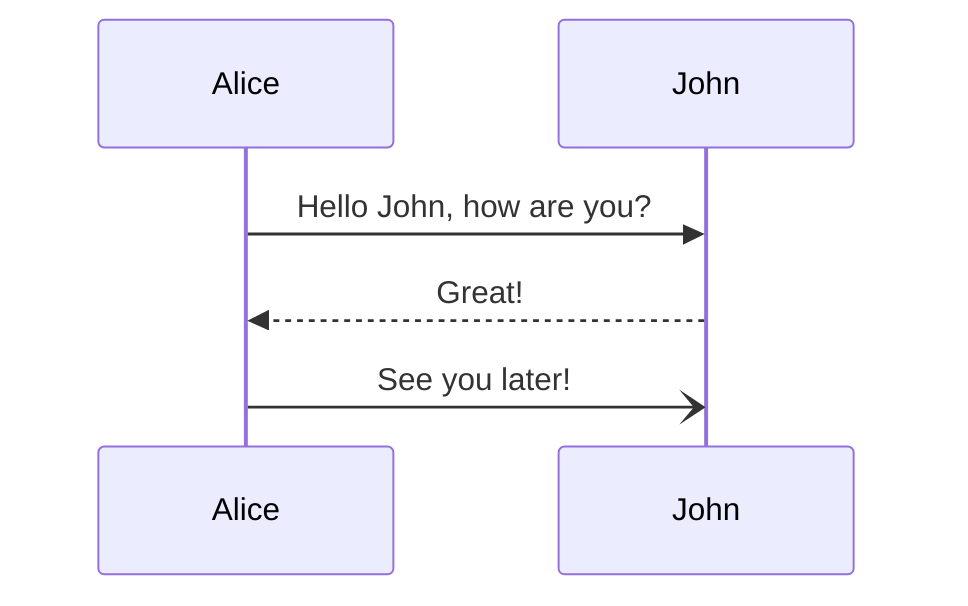
```mermaid
sequenceDiagram
    Alice->>John: Hello John, how are you?
    John-->>Alice: Great!
    Alice-)John: See you later!
```


## 语法

### Participants / 参与者

参与者可以像本页第一个示例那样隐式定义。参与者或角色按照他们在图表源文本中出现的顺序呈现。有时，您可能希望以与第一条消息中不同的顺序显示参与者。

可以通过以下方式指定角色的出现顺序（按照书写的顺序）：

```yaml
sequenceDiagram
    participant Alice
    participant Bob
    Bob->>Alice: Hi Alice
    Alice->>Bob: Hi Bob
```

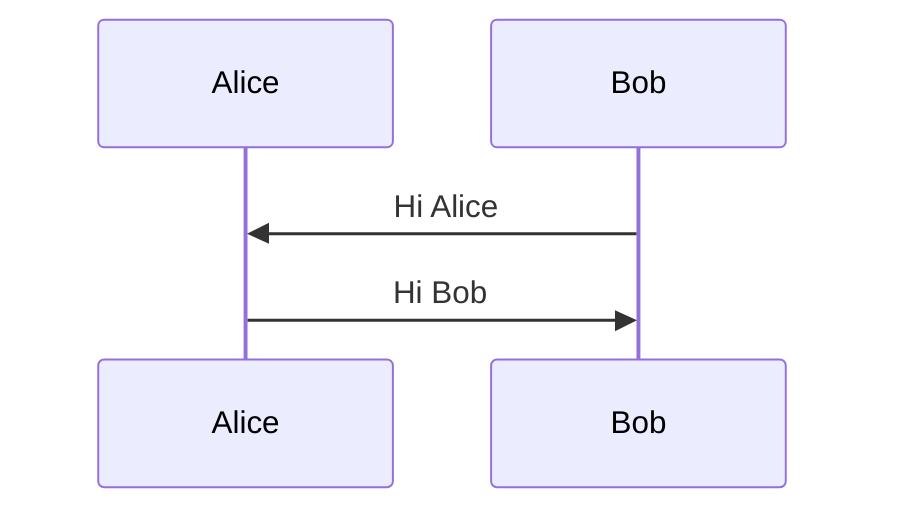
```mermaid
sequenceDiagram
    participant Alice
    participant Bob
    Bob->>Alice: Hi Alice
    Alice->>Bob: Hi Bob
```

### Actor

如果您想要使用 Actor 符号而不是带有文本的矩形，您可以使用如下所示的 Actor 语句来实现。

```yaml
sequenceDiagram
    actor Alice
    actor Bob
    Alice->>Bob: Hi Bob
    Bob->>Alice: Hi Alice
```

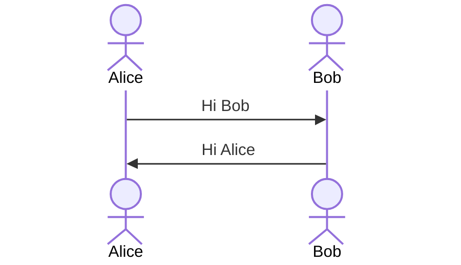
```mermaid
sequenceDiagram
    actor Alice
    actor Bob
    Alice->>Bob: Hi Bob
    Bob->>Alice: Hi Alice
```

类似的，还可以把参与者设置为 Boundary / Control / Entity / Database / Collections / Queue 。

### Aliases / 别名

参与者可以拥有一个方便的标识符和一个描述性标签

```yaml
sequenceDiagram
    participant A as Alice
    participant J as John
    A->>J: Hello John, how are you?
    J->>A: Great!
```

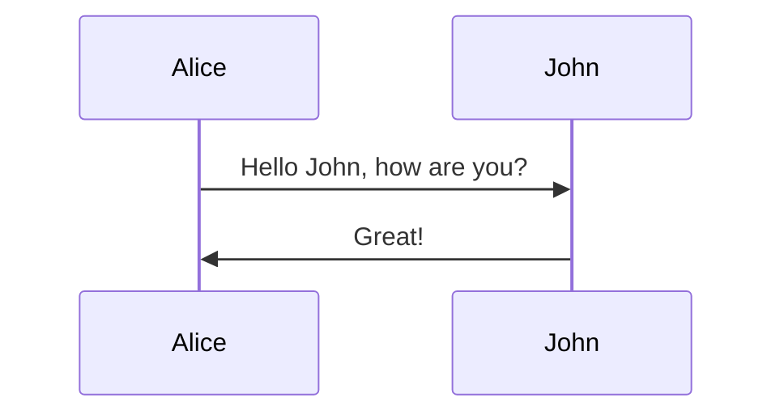
```mermaid
sequenceDiagram
    participant A as Alice
    participant J as John
    A->>J: Hello John, how are you?
    J->>A: Great!
```

### 角色创建与销毁

可以通过消息创建和销毁 Actor。为此，请在消息前添加 create 或 destroy 指令。

```yaml
sequenceDiagram
    Alice->>Bob: Hello Bob, how are you ?
    Bob->>Alice: Fine, thank you. And you?
    create participant Carl
    Alice->>Carl: Hi Carl!
    create actor D as Donald
    Carl->>D: Hi!
    destroy Carl
    Alice-xCarl: We are too many
    destroy Bob
    Bob->>Alice: I agree
```
+


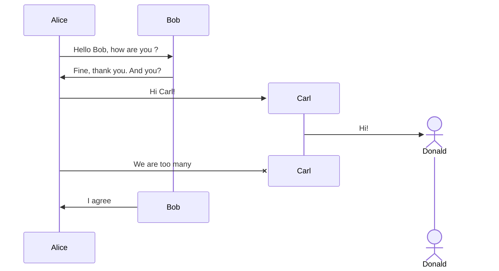
```mermaid
sequenceDiagram
    Alice->>Bob: Hello Bob, how are you ?
    Bob->>Alice: Fine, thank you. And you?
    create participant Carl
    Alice->>Carl: Hi Carl!
    create actor D as Donald
    Carl->>D: Hi!
    destroy Carl
    Alice-xCarl: We are too many
    destroy Bob
    Bob->>Alice: I agree
```

备注： 带 create 语法后 hugo 渲染报错。

### Grouping / Box

可以将角色分组到垂直方框中。您可以使用以下符号定义颜色（否则将为透明）和/或描述性标签：


### Messages / 消息

信息可以有两种显示方式，可以是实线或虚线。

```
[Actor][Arrow][Actor]:Message text
```

目前支持十种类型的箭头：

| Type 类型 | Description 描述             |
| :-------- | :--------------------------- |
| `->`      | 无箭头的实线                 |
| `-->`     | 无箭头的虚线                 |
| `->>`     | 带箭头的实线                 |
| `-->>`    | 带箭头的虚线                 |
| `<<->>`   | 带双向箭头的实线             |
| `<<-->>`  | 带双向箭头的虚线             |
| `-x`      | 末端带十字的实线             |
| `--x`     | 末端带叉的虚线               |
| `-)`      | 末端带开放箭头的实线（异步） |
| `--)`     | 末端带开放箭头的虚线（异步） |

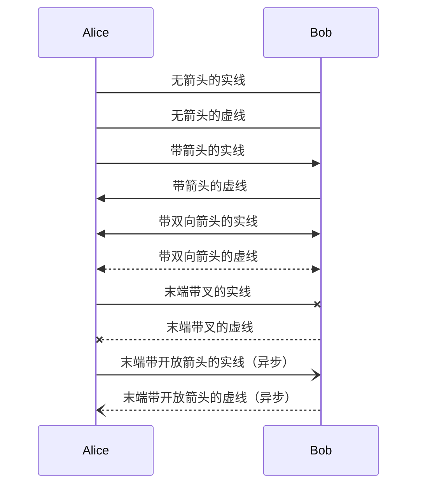
```mermaid
sequenceDiagram
    Alice->Bob: 无箭头的实线
    Bob->Alice: 无箭头的虚线
    Alice->>Bob: 带箭头的实线
    Bob->>Alice: 带箭头的虚线
    Alice<<->>Bob: 带双向箭头的实线
    Bob<<-->>Alice: 带双向箭头的虚线
    Alice-xBob: 末端带叉的实线
    Bob--xAlice: 末端带叉的虚线
    Alice-)Bob: 末端带开放箭头的实线（异步）
    Bob--)Alice: 末端带开放箭头的虚线（异步）
```

### Activations / 激活

可以激活和停用一个角色。角色可以通过专门的声明来控制：

```yaml
sequenceDiagram
    Alice->>John: Hello John, how are you?
    activate John
    John-->>Alice: Great!
    deactivate John
```

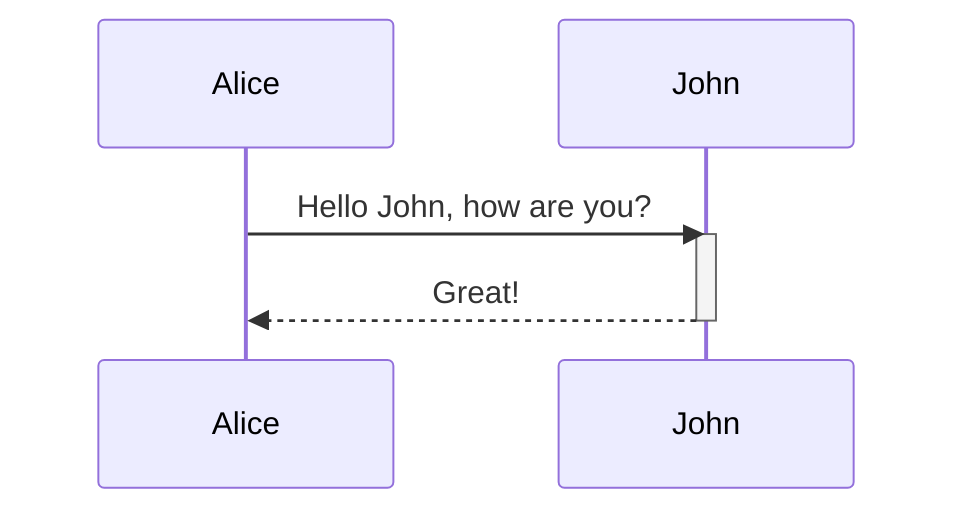
```mermaid
sequenceDiagram
    Alice->>John: Hello John, how are you?
    activate John
    John-->>Alice: Great!
    deactivate John
```

还有一种简写方式，就是在消息箭头后添加 `+` / `-` 后缀：

```yaml
sequenceDiagram
    Alice->>+John: Hello John, how are you?
    John-->>-Alice: Great!
```

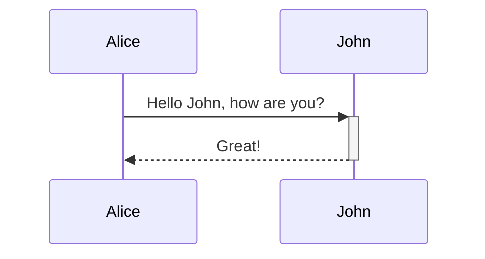
```mermaid
sequenceDiagram
    Alice->>+John: Hello John, how are you?
    John-->>-Alice: Great!
```

同一角色可以叠加激活：

```yaml
sequenceDiagram
    Alice->>+John: Hello John, how are you?
    Alice->>+John: John, can you hear me?
    John-->>-Alice: Hi Alice, I can hear you!
    John-->>-Alice: I feel great!
```

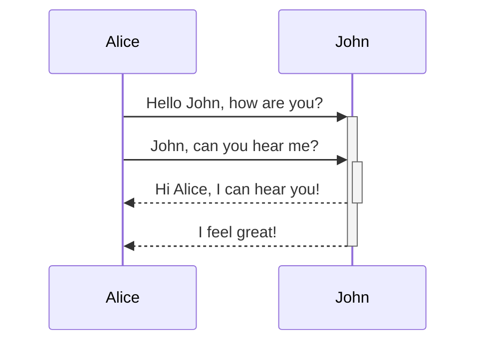
```mermaid
sequenceDiagram
    Alice->>+John: Hello John, how are you?
    Alice->>+John: John, can you hear me?
    John-->>-Alice: Hi Alice, I can hear you!
    John-->>-Alice: I feel great!
```

### Notes / 备注

可以在序列图中添加备注。添加备注的符号为：`Note [ right of | left of | over ] [Actor]: Text in note content`

```yaml
sequenceDiagram
    participant John
    Note right of John: Text in note
```

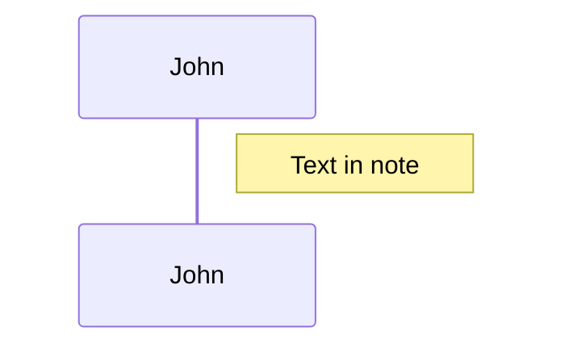
```mermaid
sequenceDiagram
    participant John
    Note right of John: Text in note
```

也可以创建跨越两位参与者的备注：

```yaml
sequenceDiagram
    Alice->John: Hello John, how are you?
    Note over Alice,John: A typical interaction
```

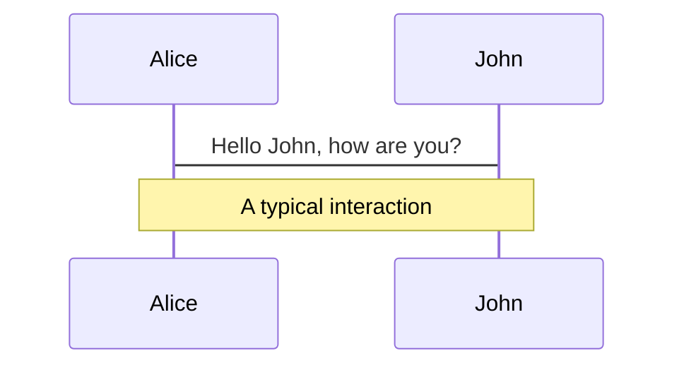
```mermaid
sequenceDiagram
    Alice->John: Hello John, how are you?
    Note over Alice,John: A typical interaction
```

备注：只能跨两个参与者，如果要跨越多个，只需要填写一头一尾两个参与者即可。

### Line breaks / 换行符

可以在备注和留言中添加换行符：

```yaml
sequenceDiagram
    Alice->John: Hello John,<br/>how are you?
    Note over Alice,John: A typical interaction<br/>But now in two lines
```

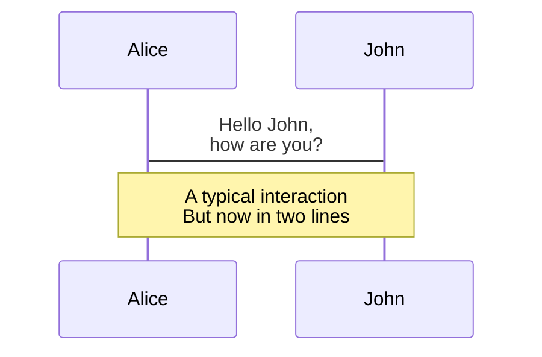
```mermaid
sequenceDiagram
    Alice->John: Hello John,<br/>how are you?
    Note over Alice,John: A typical interaction<br/>But now in two lines
```

Actor 姓名中的换行符需要使用别名：

```yaml
sequenceDiagram
    participant Alice as Alice<br/>Johnson
    Alice->John: Hello John,<br/>how are you?
    Note over Alice,John: A typical interaction<br/>But now in two lines
```

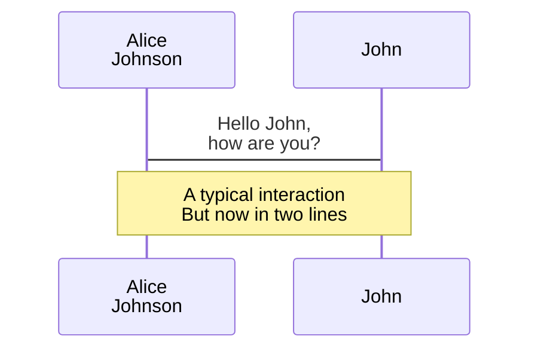
```mermaid
sequenceDiagram
    participant Alice as Alice<br/>Johnson
    Alice->John: Hello John,<br/>how are you?
    Note over Alice,John: A typical interaction<br/>But now in two lines
```

### Loops / 循环

可以在序列图中表示循环。这是通过以下符号实现的：

```yaml
loop Loop text
... statements ...
end
```

例子如下：

```yaml
sequenceDiagram
    Alice->John: Hello John, how are you?
    loop Every minute
        John-->Alice: Great!
    end
```

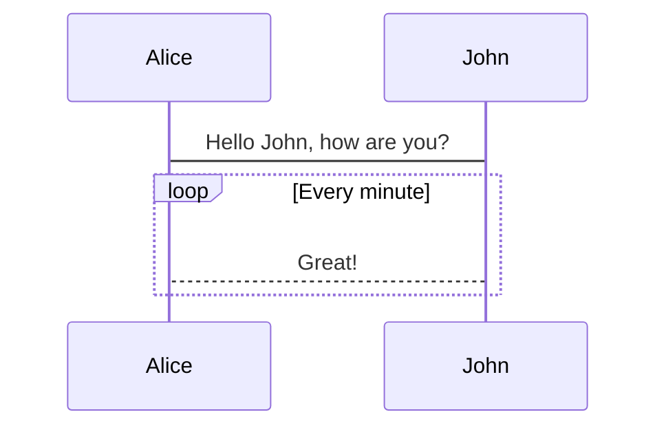
```mermaid
sequenceDiagram
    Alice->John: Hello John, how are you?
    loop Every minute
        John-->Alice: Great!
    end
```

## Alt / 多种可选路径

在序列图中可以表示多种可选路径。这可以通过以下符号来实现：

```yaml
alt Describing text
... statements ...
else
... statements ...
end
```

或者，如果存在可选序列（如果没有 else 语句）。

```bash
opt Describing text
... statements ...
end
```

例子：

```yaml
sequenceDiagram
    Alice->>Bob: Hello Bob, how are you?
    alt is sick
        Bob->>Alice: Not so good :(
    else is well
        Bob->>Alice: Feeling fresh like a daisy
    end
    opt Extra response
        Bob->>Alice: Thanks for asking
    end
```

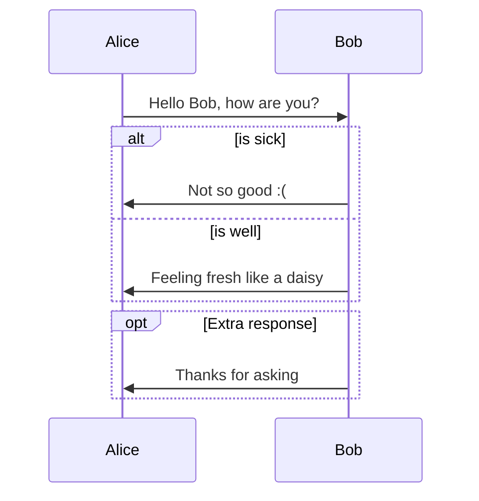
```mermaid
sequenceDiagram
    Alice->>Bob: Hello Bob, how are you?
    alt is sick
        Bob->>Alice: Not so good :(
    else is well
        Bob->>Alice: Feeling fresh like a daisy
    end
    opt Extra response
        Bob->>Alice: Thanks for asking
    end
    
```

### Parallel / 平行线

可以显示同时发生的动作。这是通过符号实现的。

```yaml
par [Action 1]
... statements ...
and [Action 2]
... statements ...
and [Action N]
... statements ...
end
```

例子：

```yaml
sequenceDiagram
    par Alice to Bob
        Alice->>Bob: Hello guys!
    and Alice to John
        Alice->>John: Hello guys!
    end
    Bob-->>Alice: Hi Alice!
    John-->>Alice: Hi Alice!
```

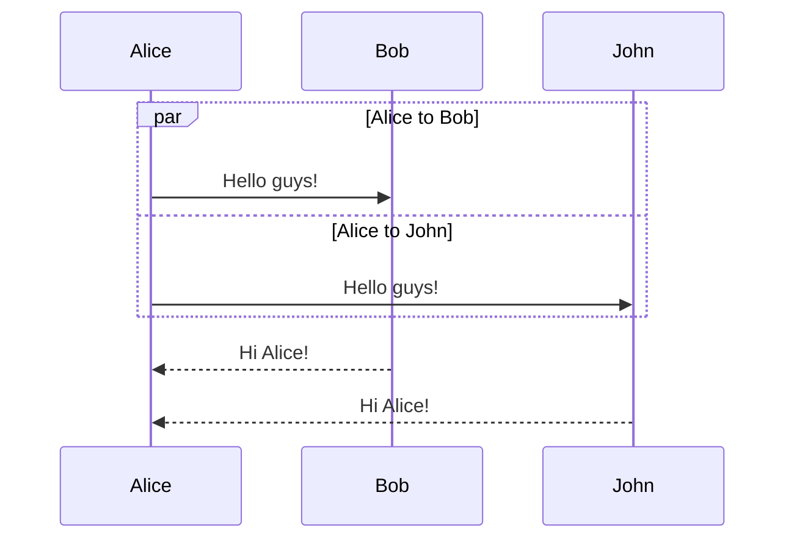
```mermaid
sequenceDiagram
    par Alice to Bob
        Alice->>Bob: Hello guys!
    and Alice to John
        Alice->>John: Hello guys!
    end
    Bob-->>Alice: Hi Alice!
    John-->>Alice: Hi Alice!

```

也可以嵌套并行块。

```yaml
sequenceDiagram
    par Alice to Bob
        Alice->>Bob: Go help John
    and Alice to John
        Alice->>John: I want this done today
        par John to Charlie
            John->>Charlie: Can we do this today?
        and John to Diana
            John->>Diana: Can you help us today?
        end
    end

```

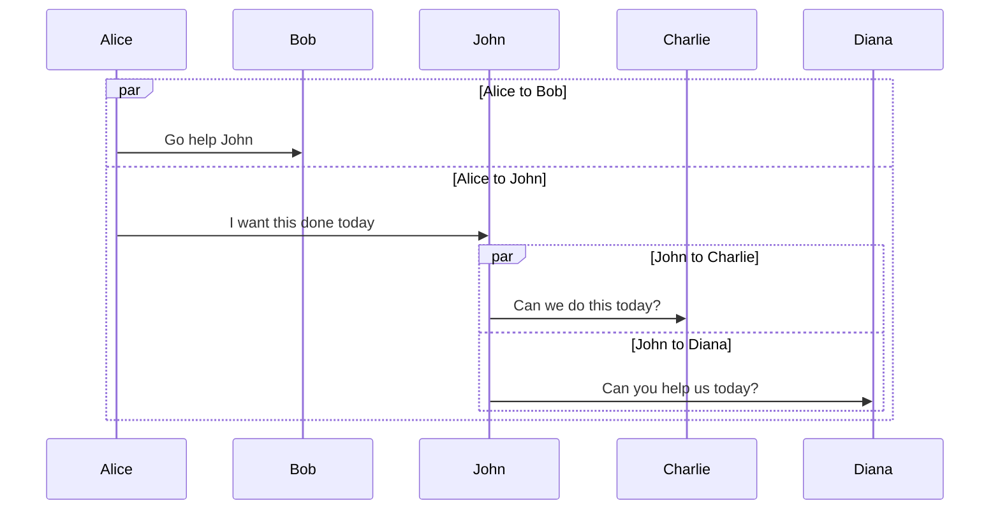
```mermaid
sequenceDiagram
    par Alice to Bob
        Alice->>Bob: Go help John
    and Alice to John
        Alice->>John: I want this done today
        par John to Charlie
            John->>Charlie: Can we do this today?
        and John to Diana
            John->>Diana: Can you help us today?
        end
    end

```

### Critical Region / 关键区域

可以通过条件处理来显示必须自动执行的操作。

```yaml
critical [Action that must be performed]
... statements ...
option [Circumstance A]
... statements ...
option [Circumstance B]
... statements ...
end
```

例子：

```yaml
sequenceDiagram
    critical Establish a connection to the DB
        Service-->DB: connect
    option Network timeout
        Service-->Service: Log error
    option Credentials rejected
        Service-->Service: Log different error
    end

```

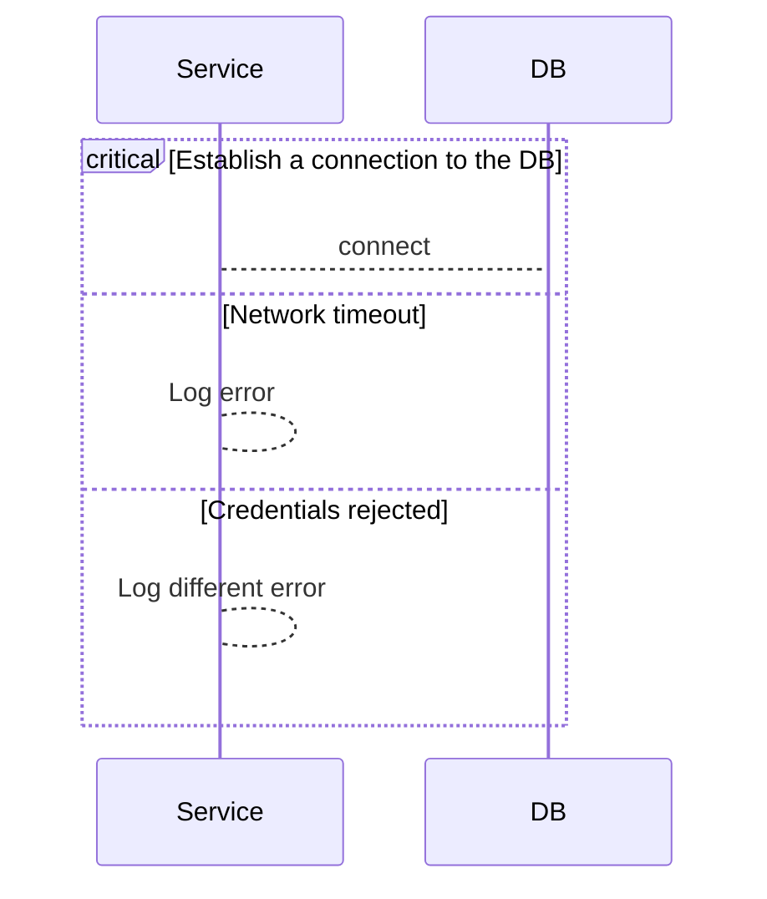
```mermaid
sequenceDiagram
    critical Establish a connection to the DB
        Service-->DB: connect
    option Network timeout
        Service-->Service: Log error
    option Credentials rejected
        Service-->Service: Log different error
    end

```

也可能完全没有任何选择。

```yaml
sequenceDiagram
    critical Establish a connection to the DB
        Service-->DB: connect
    end
```

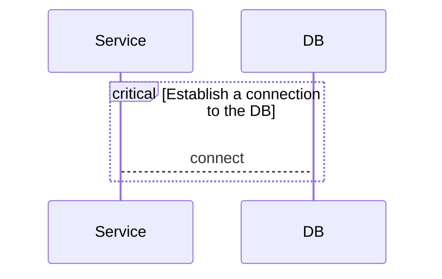
```mermaid
sequenceDiagram
    critical Establish a connection to the DB
        Service-->DB: connect
    end
```

这个关键代码块也可以嵌套，与上面看到的 `par` 语句等效。

### Break / 休息

可以在流程中指示序列的停止（通常用于模拟异常情况）。

```yaml
break [something happened]
... statements ...
end
```

例子:

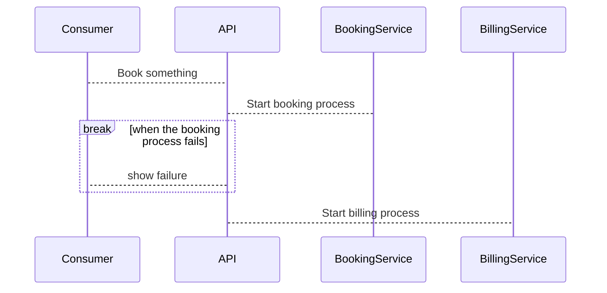
```mermaid
sequenceDiagram
    Consumer-->API: Book something
    API-->BookingService: Start booking process
    break when the booking process fails
        API-->Consumer: show failure
    end
    API-->BillingService: Start billing process

```

### 背景高亮显示

可以通过提供彩色背景矩形来突出显示流程。这是通过以下符号实现的：

```yaml
rect COLOR
... content ...
end
```

```yaml
rect rgb(0, 255, 0)
... content ...
end
```

例子：

```yaml
sequenceDiagram
    participant Alice
    participant John

    rect rgb(191, 223, 255)
    note right of Alice: Alice calls John.
    Alice->>+John: Hello John, how are you?
    rect rgb(200, 150, 255)
    Alice->>+John: John, can you hear me?
    John-->>-Alice: Hi Alice, I can hear you!
    end
    John-->>-Alice: I feel great!
    end
    Alice ->>+ John: Did you want to go to the game tonight?
    John -->>- Alice: Yeah! See you there.
```

```mermaid
sequenceDiagram
    participant Alice
    participant John

    rect rgb(191, 223, 255)
    note right of Alice: Alice calls John.
    Alice->>+John: Hello John, how are you?
    rect rgb(200, 150, 255)
    Alice->>+John: John, can you hear me?
    John-->>-Alice: Hi Alice, I can hear you!
    end
    John-->>-Alice: I feel great!
    end
    Alice ->>+ John: Did you want to go to the game tonight?
    John -->>- Alice: Yeah! See you there.
```

### Comments / 评论

可以在序列图中输入注释，解析器会忽略这些注释。

注释必须单独占一行，并且必须以 `%%` （双百分号）开头。

注释开始到下一个换行符之间的任何文本都将被视为注释，包括任何图表语法。

```yaml
sequenceDiagram
    Alice->>John: Hello John, how are you?
    %% this is a comment
    John-->>Alice: Great!
```

```mermaid
sequenceDiagram
    Alice->>John: Hello John, how are you?
    %% this is a comment
    John-->>Alice: Great!
```

### 实体代码用于转义字符

可以使用此处示例所示的语法对字符进行转义。

```yaml
sequenceDiagram
    A->>B: I #9829; you!
    B->>A: I #9829; you #infin; times more!
```

```mermaid
sequenceDiagram
    A->>B: I #9829; you!
    B->>A: I #9829; you #infin; times more!
```

给出的数字是十进制的，所以 `#` 可以编码为 `#35;` 也支持使用 HTML 字符名称。

因为可以使用分号代替换行符来定义标记，所以你需要使用 `#59;` 在消息文本中包含分号。

### sequenceNumbers / 序列号

可以在序列图中的每个箭头上附加一个序列号。这可以在将 Mermaid 添加到网站时进行配置，如下所示：

可以通过图中所示的代码来开启：

```yaml
sequenceDiagram
    autonumber
    Alice->>John: Hello John, how are you?
    loop HealthCheck
        John->>John: Fight against hypochondria
    end
    Note right of John: Rational thoughts!
    John-->>Alice: Great!
    John->>Bob: How about you?
    Bob-->>John: Jolly good!
```

```mermaid
sequenceDiagram
    autonumber
    Alice->>John: Hello John, how are you?
    loop HealthCheck
        John->>John: Fight against hypochondria
    end
    Note right of John: Rational thoughts!
    John-->>Alice: Great!
    John->>Bob: How about you?
    Bob-->>John: Jolly good!

```

## 造型

序列图的样式是通过定义若干 CSS 类来实现的。在渲染过程中，这些类会从位于 src/themes/sequence.scss 的文件中提取出来。

### 使用的class

### 类

| Class 班级                    | Description 描述             |
| :---------------------------- | :--------------------------- |
| actor 演员                    | 演员框样式。                 |
| actor-top 顶级演员            | 图表顶部演员形象/框的样式。  |
| actor-bottom 演员底部         | 图表底部演员形象/框的样式。  |
| text.actor 文本演员           | 所有演员的文本样式。         |
| text.actor-box 文本.演员-框   | 演员框文本样式。             |
| text.actor-man 文本.演员-男人 | 演员形象文本的样式。         |
| actor-line 演员台词           | 演员的竖线。                 |
| messageLine0 消息行0          | 实线消息框的样式。           |
| messageLine1 消息行1          | 虚线消息行的样式。           |
| messageText 消息文本          | 定义消息箭头上文本的样式。   |
| labelBox 标签框               | 在循环中定义左侧的样式标签。 |
| labelText 标签文本            | 循环标签中文本的样式。       |
| loopText 循环文本             | 循环框中文本的样式。         |
| loopLine 环线                 | 定义循环框中线条的样式。     |
| note 备注                     | 备注框样式。                 |
| noteText 注释文本             | 备注框中文本的样式。         |

### 示例样式表

```css
body {
  background: white;
}

.actor {
  stroke: #ccccff;
  fill: #ececff;
}
text.actor {
  fill: black;
  stroke: none;
  font-family: Helvetica;
}

.actor-line {
  stroke: grey;
}

.messageLine0 {
  stroke-width: 1.5;
  stroke-dasharray: '2 2';
  marker-end: 'url(#arrowhead)';
  stroke: black;
}

.messageLine1 {
  stroke-width: 1.5;
  stroke-dasharray: '2 2';
  stroke: black;
}

#arrowhead {
  fill: black;
}

.messageText {
  fill: black;
  stroke: none;
  font-family: 'trebuchet ms', verdana, arial;
  font-size: 14px;
}

.labelBox {
  stroke: #ccccff;
  fill: #ececff;
}

.labelText {
  fill: black;
  stroke: none;
  font-family: 'trebuchet ms', verdana, arial;
}

.loopText {
  fill: black;
  stroke: none;
  font-family: 'trebuchet ms', verdana, arial;
}

.loopLine {
  stroke-width: 2;
  stroke-dasharray: '2 2';
  marker-end: 'url(#arrowhead)';
  stroke: #ccccff;
}

.note {
  stroke: #decc93;
  fill: #fff5ad;
}

.noteText {
  fill: black;
  stroke: none;
  font-family: 'trebuchet ms', verdana, arial;
  font-size: 14px;
}
```

## 配置

可以调整边距以渲染序列图。

这可以通过定义 `mermaid.sequenceConfig` 或使用 CLI 调用包含配置的 JSON 文件来实现。如何使用 CLI 请参阅 [mermaidCLI](https://mermaid.js.org/config/mermaidCLI.html) 页面。 `mermaid.sequenceConfig` 可以设置为包含配置参数的 JSON 字符串或相应的对象。

```json
mermaid.sequenceConfig = {
  diagramMarginX: 50,
  diagramMarginY: 10,
  boxTextMargin: 5,
  noteMargin: 10,
  messageMargin: 35,
  mirrorActors: true,
};
```

可能的配置参数：

| Parameter 范围                 | Description 描述                                             | Default value 默认值           |
| :----------------------------- | :----------------------------------------------------------- | :----------------------------- |
| mirrorActors 镜像演员          | 开启/关闭图表下方(和上方角色一样）的渲染。                   | false                          |
| bottomMarginAdj 底部边距调整   | 调整图表向下延伸的距离。使用 CSS 设置宽边框样式可能会导致不必要的裁剪，因此需要此配置参数。 | 1                              |
| actorFontSize 演员字体大小     | 设置演员描述文字的字体大小                                   | 14                             |
| actorFontFamily 演员字体       | 设置演员描述所用的字体。                                     | "Open Sans", sans-serif        |
| actorFontWeight 演员字体粗细   | 设置演员描述文字的字体粗细                                   | "Open Sans", sans-serif        |
| noteFontSize 备注字体大小      | 设置演员附加备注的字体大小                                   | 14                             |
| noteFontFamily 备注字体系列    | 设置演员附言的字体系列                                       | "trebuchet ms", verdana, arial |
| noteFontWeight 注意字体粗细    | 设置演员附加备注的字体粗细                                   | "trebuchet ms", verdana, arial |
| noteAlign 注意对齐             | 设置演员附加备注中文本的对齐方式                             | center 中心                    |
| messageFontSize 消息字体大小   | 设置演员之间消息的字体大小                                   | 16                             |
| messageFontFamily 消息字体系列 | 设置演员之间消息的字体系列                                   | "trebuchet ms", verdana, arial |
| messageFontWeight 消息字体粗细 | 设置演员之间消息的字体粗细                                   | "trebuchet ms", verdana, arial |

例子，去掉 actor 下方的渲染：

```yaml
sequenceDiagram
    Alice->>John: Hello John, how are you?
    John-->>Alice: Great!
```

```mermaid
---
config:
  sequence:
    mirrorActors: false
---
sequenceDiagram
    Alice->>John: Hello John, how are you?
    John-->>Alice: Great!
```

