https://mermaid.js.org/syntax/stateDiagram.html

---

> “状态图是计算机科学及相关领域中用于描述系统行为的一种图表。状态图要求所描述的系统由有限数量的状态组成；有时确实如此，而有时这只是一种合理的抽象。”——维基百科

Mermaid 可以渲染状态图。其语法力求与 plantUml 的语法保持一致，以便用户更轻松地在 Mermaid 和 plantUml 之间共享状态图。

```yaml
---
title: Simple sample
---
stateDiagram-v2
    [*] --> Still
    Still --> [*]

    Still --> Moving
    Moving --> Still
    Moving --> Crash
    Crash --> [*]
```

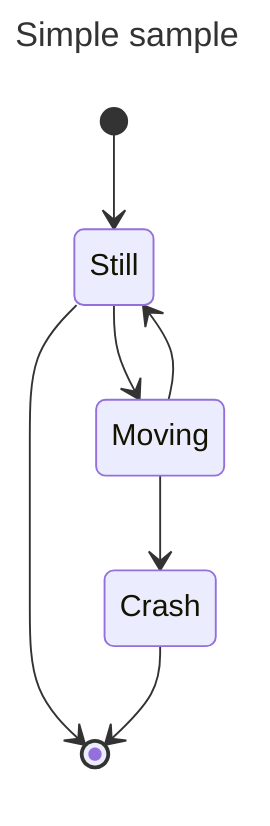

在状态图中，系统通过状态来描述，并说明一个状态如何通过转换而改变到另一个状态 。 上面的示例图显示了三个状态： 静止 、 移动和崩溃 。初始状态为静止 。从静止状态可以转换到移动状态。从移动状态可以转换回静止状态或崩溃状态。 静止状态到崩溃状态之间没有转换。（静止状态下不会崩溃。）

## 状态

状态可以通过多种方式声明。最简单的方式是仅使用 id 定义状态：

```yaml
stateDiagram-v2
    stateId
```

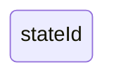

另一种方法是使用 state 关键字，并附上如下描述：

```yaml
stateDiagram-v2
    state "This is a state description" as s2
```

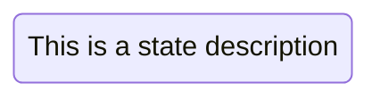

另一种定义带有描述的状态的方法是，定义状态 ID，后跟冒号和描述：

```yaml
stateDiagram-v2
    s2 : This is a state description
```


## 转换

状态转换是指一个状态过渡到另一个状态的路径/边。这用文本箭头“-->”表示。

当您定义两个状态之间的转换，且这两个状态尚未定义时，系统会使用转换的 ID 来定义未定义的状态。之后，您可以为以这种方式定义的状态添加描述。

```yaml
stateDiagram-v2
    s1 --> s2
```

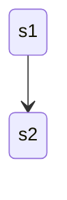

可以在转换效果中添加文本来描述它所代表的含义：

```yaml
stateDiagram-v2
    s1 --> s2: A transition
```

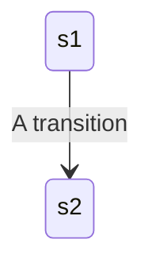

## 开始和结束

图中有两个特殊状态分别表示图表的开始和结束。这些状态用 [*] 语法表示，状态转换的方向决定了它是开始状态还是结束状态。

```yaml
stateDiagram-v2
    [*] --> s1
    s1 --> [*]
```


## 复合状态

在实际应用中，状态图通常是多维的，因为一个状态可以有多个内部状态。在这种术语中，这些状态被称为复合状态。

要定义复合状态，您需要使用 `state` 关键字，后跟一个 ID，以及用 `{}` 括起来的复合状态主体。您可以像定义简单状态一样，在单独的一行中命名复合状态。请参见以下示例：

```yaml
stateDiagram-v2
    [*] --> First
    state First {
        [*] --> second
        second --> [*]
    }

    [*] --> NamedComposite
    NamedComposite: Another Composite
    state NamedComposite {
        [*] --> namedSimple
        namedSimple --> [*]
        namedSimple: Another simple
    }
```

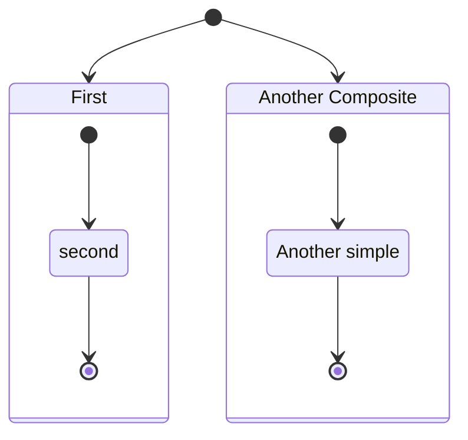

你可以分多个步骤来完成：

```yaml
stateDiagram-v2
    [*] --> First

    state First {
        [*] --> Second

        state Second {
            [*] --> second
            second --> Third

            state Third {
                [*] --> third
                third --> [*]
            }
        }
    }
```

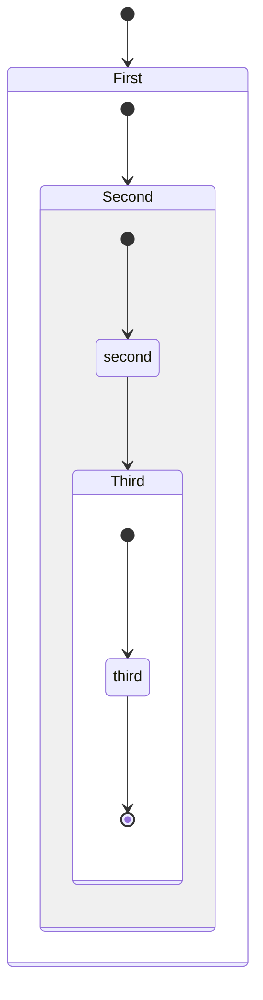

您还可以定义复合状态之间的转换：

```yaml
stateDiagram-v2
    [*] --> First
    First --> Second
    First --> Third

    state First {
        [*] --> fir
        fir --> [*]
    }
    state Second {
        [*] --> sec
        sec --> [*]
    }
    state Third {
        [*] --> thi
        thi --> [*]
    }

```

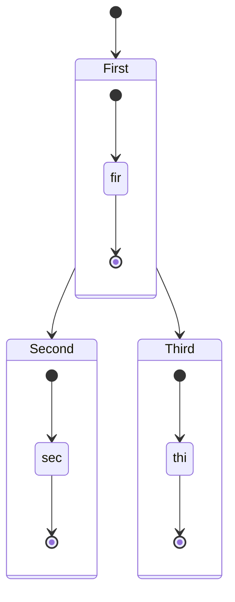

## 选择

有时你需要对两条或多条路径之间的选择进行建模，你可以使用 `<<choice> >` 来实现。

```yaml
stateDiagram-v2
    state if_state <<choice>>
    [*] --> IsPositive
    IsPositive --> if_state
    if_state --> False: if n < 0
    if_state --> True : if n >= 0
```

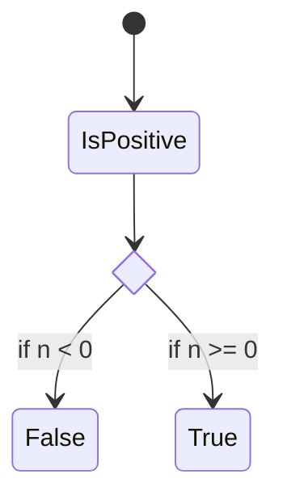

## 分叉

可以使用 `<<fork> > <<join> >` 在图中指定一个分叉。

```yaml
   stateDiagram-v2
    state fork_state <<fork>>
      [*] --> fork_state
      fork_state --> State2
      fork_state --> State3

      state join_state <<join>>
      State2 --> join_state
      State3 --> join_state
      join_state --> State4
      State4 --> [*]
```

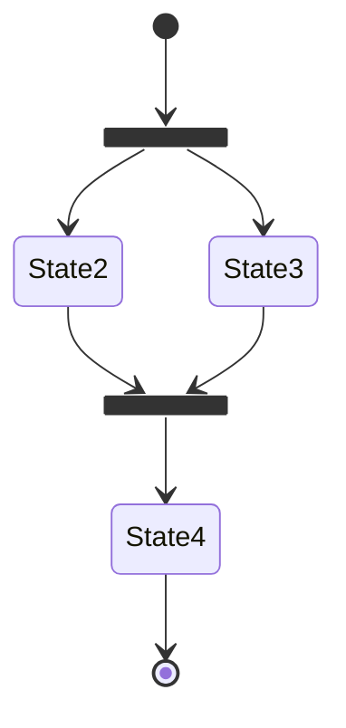

## 备注


有时候，没有什么比一张便签纸更能说明问题了。状态图也是如此。

在这里，您可以选择将备注放在节点的*右侧*或*左侧* 。

```yaml
    stateDiagram-v2
        State1: The state with a note
        note right of State1
            Important information! You can write
            notes.
        end note
        State1 --> State2
        note left of State2 : This is the note to the left.

```

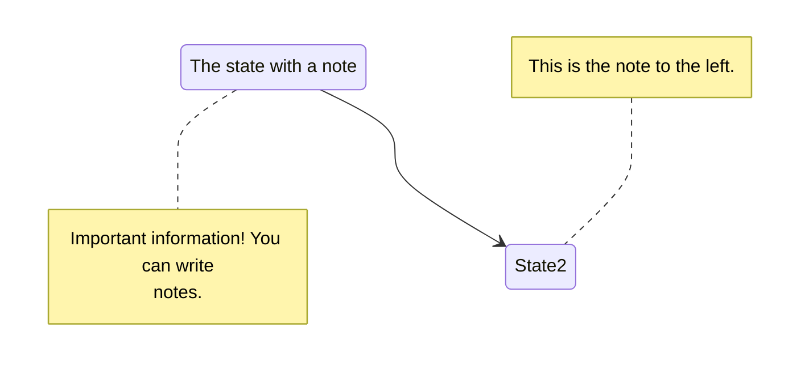

## 并发

与 plantUml 类似，您可以使用 -- 符号指定并发性。

```yaml
stateDiagram-v2
    [*] --> Active

    state Active {
        [*] --> NumLockOff
        NumLockOff --> NumLockOn : EvNumLockPressed
        NumLockOn --> NumLockOff : EvNumLockPressed
        --
        [*] --> CapsLockOff
        CapsLockOff --> CapsLockOn : EvCapsLockPressed
        CapsLockOn --> CapsLockOff : EvCapsLockPressed
        --
        [*] --> ScrollLockOff
        ScrollLockOff --> ScrollLockOn : EvScrollLockPressed
        ScrollLockOn --> ScrollLockOff : EvScrollLockPressed
    }

```

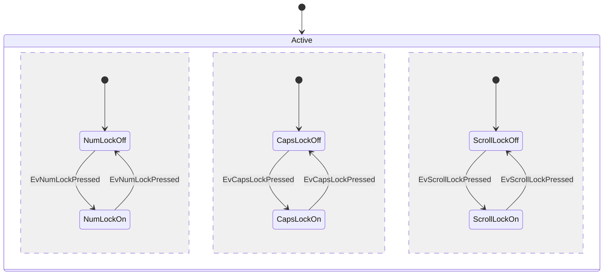

## 确定图表方向

使用状态图时，可以使用 direction 语句来设置图表的渲染方向，如本例所示。

```yaml
stateDiagram
    direction LR
    [*] --> A
    A --> B
    B --> C
    state B {
      direction LR
      a --> b
    }
    B --> D

```

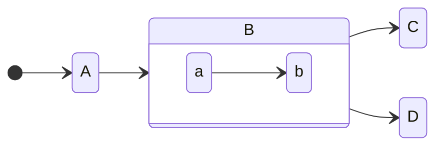

具体的方向有：

- LR：从左向右
- RL：从右向左
- TB  : 从上往下
- BT：从下往上

## 注释

状态图内可以添加注释，但解析器会忽略这些注释。注释必须单独占一行，并且必须以 `%%` （双百分号）开头。注释内容到下一个换行符之间的任何文本，包括任何图表语法，都将被视为注释。

```yaml
stateDiagram-v2
    [*] --> Still
    Still --> [*]
%% this is a comment
    Still --> Moving
    Moving --> Still %% another comment
    Moving --> Crash
    Crash --> [*]

```

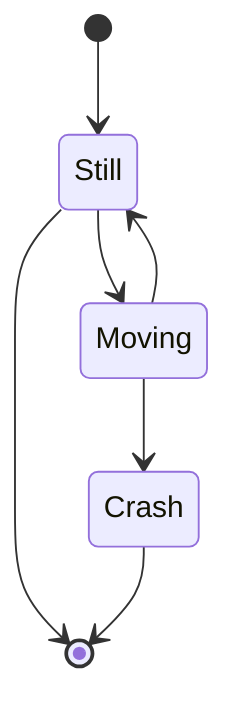


