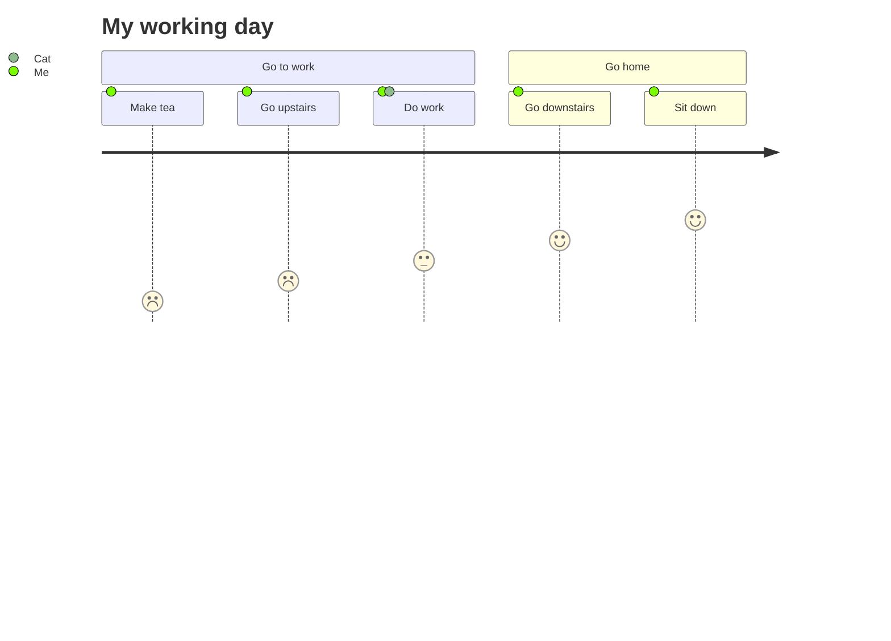

https://mermaid.js.org/syntax/userJourney.html

---

用户旅程图以高度详细的方式描述了不同用户在系统、应用程序或网站中完成特定任务的具体步骤。这种方法展示了当前（现有）的用户工作流程，并揭示了未来工作流程中需要改进的地方。（维基百科）

## 渲染

Mermaid 可以渲染用户旅程图：

```yaml
journey
    title My working day
    section Go to work
      Make tea: 1: Me
      Go upstairs: 2: Me
      Do work: 3: Me, Cat
    section Go home
      Go downstairs: 4: Me
      Sit down: 5: Me
```



每个用户旅程都被分成若干部分，这些部分描述了用户正在尝试完成的任务的某个部分。

任务语法为 `Task name: <score>: <comma separated list of actors>`

得分是介于 1 到 5 之间的数字（包含 1 和 5）。

## score 

在 Mermaid 的用户旅程图（User Journey Diagram）中，score（分数）主要用于表示用户在执行某个特定步骤时的**情感状态（Emotional State）\**或\**满意度**。

1 到 5 分的含义对照表: 

| 分数  | 情感状态                      | 渲染图标 (示意) | 含义描述                                                 |
| ----- | ----------------------------- | --------------- | -------------------------------------------------------- |
| **5** | **非常满意 (Very Happy)**     | 😄 / 😍           | 体验极佳，流程非常顺畅，超出了用户的预期。               |
| **4** | **满意 (Happy)**              | 🙂               | 体验良好，没有遇到障碍，符合预期。                       |
| **3** | **一般/中立 (Neutral)**       | 😐               | 体验平平，没有特别好也没有特别差，或者用户觉得理所应当。 |
| **2** | **不满意 (Unhappy)**          | ☹️               | 体验较差，遇到了小挫折、困惑或步骤过于繁琐。             |
| **1** | **非常不满意 (Very Unhappy)** | 😫 / 😡           | 体验极差，遇到了严重的阻碍、报错或导致用户想要放弃流程。 |

为什么这个分数很重要？

1. **可视化情绪曲线**：Mermaid 会根据这些分数自动绘制一条波浪线（体验地图）。通过这条线，产品经理或设计师可以一眼看出用户在整个旅程中的**痛点（Pain Points）**在哪里（即分数最低的地方）。
2. **识别改进优先级**：通常 1 分和 2 分的步骤是急需优化和重构的环节。

