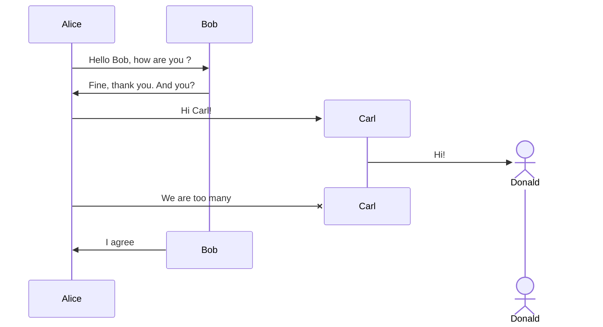

我重度使用 hugo，尤其是 hugo + docsy 主题大量用于学习笔记。

hugo + docsy 默认自带对 mermaid 的支持，但是有很多语法不支持，导致出现渲染错误。

## 解决方案

创建 Mermaid 代码块渲染钩子.

### 步骤 1: 确认 Goldmark 配置

确认当前 hugo 项目的 config.toml  中，Goldmark 渲染器允许不安全的 HTML 标记（这是渲染钩子所需的）。

```toml
[markup]
  [markup.goldmark]
    [markup.goldmark.renderer]
      unsafe = true
```

### 步骤 2: 创建渲染钩子文件

在当前的 Hugo 项目的根目录下，根据以下路径创建文件：

**文件路径:** layouts/_default/_markup/render-code-mermaid.html

文件内容为:

```
<pre class="mermaid">
    {{ .Inner }}
</pre>
```

说明：

1. render-code-mermaid.html 文件名中的 mermaid 对应于代码块语言标识（即 ```mermaid）。
2. `<pre class="mermaid">` 标签是关键。这是 Mermaid.js 库在页面加载时会查找的 HTML 结构。它告诉 Mermaid 库：“请渲染这个 pre 标签内部的内容。”
3. `{{ .Inner }}` 是 Hugo 模板语法，它会原封不动地输出 ```mermaid 代码块内的所有内容，**不会进行任何转义**，从而避免了语法错误和渲染失败。

### 步骤 3: 确保 Mermaid.js 库已加载

由于已经不再使用 Docsy 的  mermaid  shortcode （它负责加载 JS 库），您需要确保 Mermaid.js 库已在页面中加载。

在 hugo 项目根目录中创建或编辑：

文件路径: `layouts/partials/hooks/head-end.html`

文件内容:

```
<script type="text/javascript" src="https://cdn.jsdelivr.net/npm/mermaid@10.7.0/dist/mermaid.min.js"></script>
<script>
    mermaid.initialize({ startOnLoad: true });
</script>
```

下面是例子，带 create 语法后 hugo 渲染报错，改进之后 hugo 就可以正常渲染。所以如果这里渲染成功，就能验证 hugo 的 mermaid 配置成功了：




## 方案实施

验证修改之后，就可以把改动直接在 docsy 仓库中实施，这样所有共用 docsy 仓库的学习笔记就都自动更新了。

