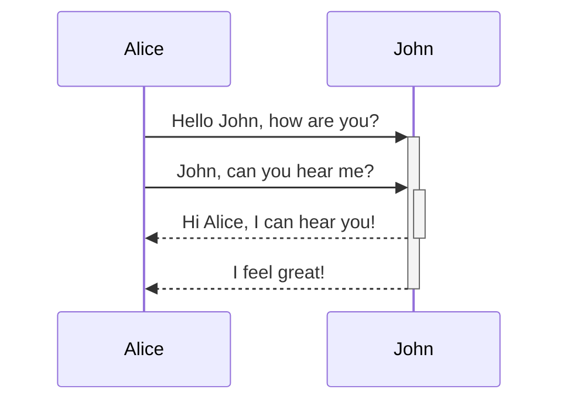
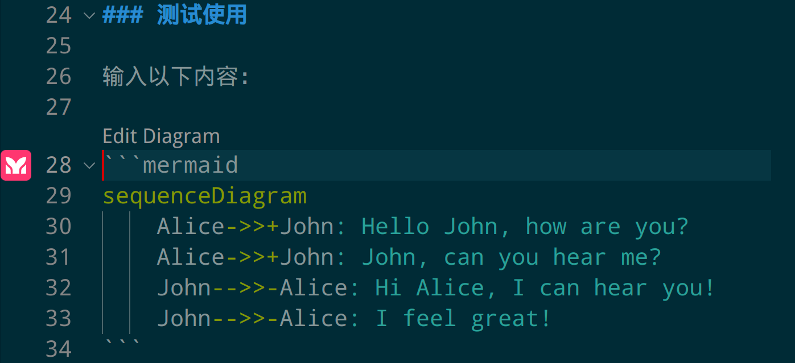
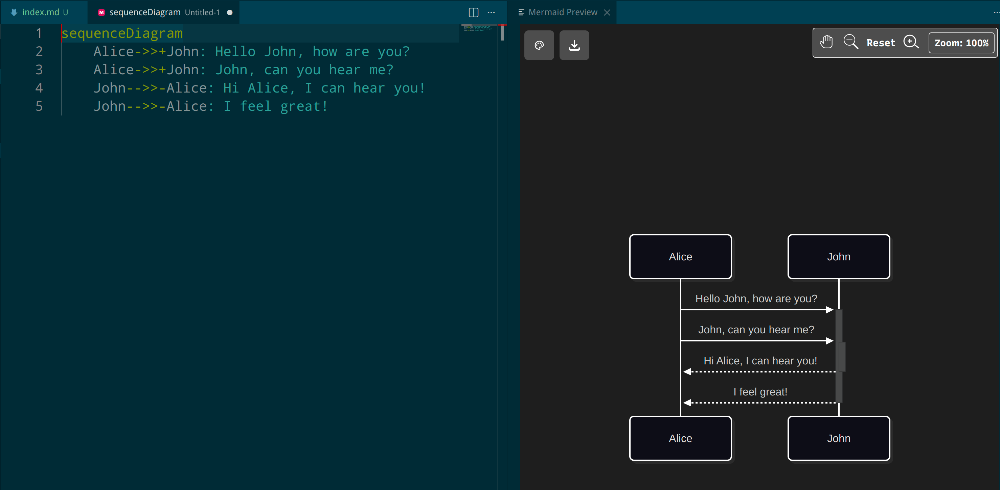

## 安装插件

在 VS Code 的 extension 中搜索 Mermaid，能找到很多 Mermaid 的插件。

我这里选择官方 Mermaid Chart 插件进行安装。

https://docs.mermaidchart.com/plugins/visual-studio-code

> 官方 Mermaid 扩展为Visual Studio Code开发者提供了无缝创建、编辑、预览和集成Mermaid chart 的功能，所有操作均可在VS Code内完成。
> 
> 现在我们提供功能丰富的本地创建、可视化及编辑Mermaid图表体验，无需注册任何账户。由Mermaid.js创建者倾注❤️打造，我们致力于提供最佳Mermaid体验并定期更新。
> 
> 您也可选择创建免费MermaidChart账户，享受云端保存与同步图表、探索Mermaid AI功能，并体验行业领先的直观拖放式Mermaid图表操作界面。

## 使用

### 测试使用

输入以下内容：

```bash
\`\`\`mermaid
sequenceDiagram
    Alice->>+John: Hello John, how are you?
    Alice->>+John: John, can you hear me?
    John-->>-Alice: Hi Alice, I can hear you!
    John-->>-Alice: I feel great!
\`\`\`
```


> 备注： 我的 hugo 默认自带了 mermaid 的支持，可以直接把 mermaid 的代码片段直接渲染为图片。

如果 extension 正常工作，就能看到：



点击 "Edit Diagram" 就能进入 mermaid 的编辑界面，如下图：



渲染界面的左上角，可以设置主题和导出图片。

插件默认的主题是 Redux Dark，比较丑，可以改成 Default ，这是 mermaid 默认主题。也可以改成 Redux Color 或者 Base。

